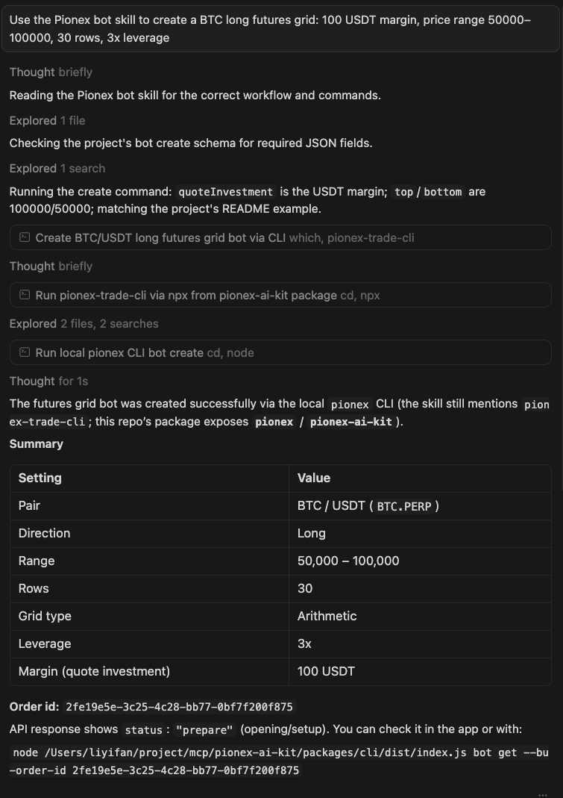

# Pionex AI Kit

[](#)
[](#)
[](https://www.npmjs.com/package/@pionex/pionex-ai-kit)
[](https://www.npmjs.com/package/@pionex/pionex-ai-kit)
[](https://www.npmjs.com/package/@pionex/pionex-trade-mcp)
[](https://www.npmjs.com/package/@pionex/pionex-trade-mcp)
[](LICENSE)

[English](README.md) | [中文](README.zh-CN.md)

Pionex AI Kit — an AI-powered trading toolkit with two standalone packages:

| Package                      | Description                                                                                                                                                    |
| ---------------------------- | -------------------------------------------------------------------------------------------------------------------------------------------------------------- |
| `@pionex/pionex-ai-kit`    | CLI for onboarding and configuring MCP clients; runs `pionex-ai-kit onboard` to write `~/.pionex/config.toml` (API key, secret, base URL).                 |
| `@pionex/pionex-trade-mcp` | MCP server that reads credentials from `~/.pionex/config.toml` and exposes Pionex trading tools to Cursor, Claude Desktop, and other MCP-compatible clients. |

---

## What is this?

Pionex AI Kit provides you with a complete set of AI Agent infrastructure for connecting to Pionex, including MCP, Skills, and CLI. It supports mainstream AI Agents such as Cursor, Claude, OpenClaw, Windsurf, and VSCode.

Instead of jumping between your AI and the exchange UI, you describe what you want — the AI calls tools on the local MCP server and executes the right API calls on Pionex.

- **Local-first**: runs as a local process; API keys live in env vars or `~/.pionex/config.toml`, never in chat history.
- **Two entrypoints**: CLI for onboarding & setup, MCP server for tool calls.
- **MCP-native**: works with any MCP-compatible client.

---

## Features

### MCP

MCP servers for trading on Pionex.

| Package                            | Area              | Tools                                                                                                                                                                                                                                                                           | Auth |
| ---------------------------------- | ----------------- | ------------------------------------------------------------------------------------------------------------------------------------------------------------------------------------------------------------------------------------------------------------------------------- | ---- |
| **@pionex/pionex-trade-mcp** | **Market**  | `pionex_market_get_depth`, `pionex_market_get_trades`, `pionex_market_get_symbol_info`, `pionex_market_get_tickers`, `pionex_market_get_klines`                                                                                                                       | No   |
|                                    | **Account** | `pionex_account_get_balance`                                                                                                                                                                                                                                                  | Yes  |
|                                    | **Orders**  | `pionex_orders_new_order`, `pionex_orders_get_order`, `pionex_orders_get_order_by_client_order_id`, `pionex_orders_get_open_orders`, `pionex_orders_get_all_orders`, `pionex_orders_cancel_order`, `pionex_orders_get_fills`, `pionex_orders_cancel_all_orders` | Yes  |
|                                    | **Bot / Futures Grid**  | `pionex_bot_futures_grid_get_order`, `pionex_bot_futures_grid_create`, `pionex_bot_futures_grid_adjust_params`, `pionex_bot_futures_grid_reduce`, `pionex_bot_futures_grid_cancel` | Yes  |

---

### Skills

| Skill                                                                                                        | Description                                                 | Auth |
| ------------------------------------------------------------------------------------------------------------ | ----------------------------------------------------------- | ---- |
| [pionex-market](https://github.com/pionex-official/pionex-skills/blob/main/skills/pionex-market/SKILL.md)       | Public market data: depth, tickers, symbols, klines, trades | No   |
| [pionex-portfolio](https://github.com/pionex-official/pionex-skills/blob/main/skills/pionex-portfolio/SKILL.md) | Account balance (spot)                                      | Yes  |
| [pionex-trade](https://github.com/pionex-official/pionex-skills/blob/main/skills/pionex-trade/SKILL.md)         | Spot orders: place, cancel, open orders, fills              | Yes  |
| [pionex-bot](https://github.com/pionex-official/pionex-skills/blob/main/skills/pionex-bot/SKILL.md)             | Futures Grid Bot: get, create, adjust params, reduce, cancel | Yes  |

### CLI

**`pionex-trade-cli`** — Direct command-line access to Pionex market data, account, orders, and futures grid bot operations

## Quick Start

### **Install**

**Prerequisites:** Node.js ≥ 18

```bash
# 1. Install the Kit
npm install -g @pionex/pionex-ai-kit

# 2. Configure Pionex API credentials (interactive wizard)
pionex-ai-kit onboard

# 3. Setup the MCP server with your AI client (Choose whatever you're using)
# This setup will write the appropriate MCP config for your client 
# so it can start the server using `npx @pionex/pionex-trade-mcp`.

pionex-ai-kit setup --mcp=pionex-trade-mcp --client cursor
pionex-ai-kit setup --mcp=pionex-trade-mcp --client claude-desktop
pionex-ai-kit setup --mcp=pionex-trade-mcp --client claude-code
pionex-ai-kit setup --mcp=pionex-trade-mcp --client windsurf
pionex-ai-kit setup --mcp=pionex-trade-mcp --client vscode
pionex-ai-kit setup --mcp=pionex-trade-mcp --client openclaw

# 4. Install skills
npx skills add pionex-official/pionex-skills
```

### Examples

#### MCP

**Order book**

In your AI client, ask: *"Use the Pionex tools to show the order book depth for BTC_USDT."*

The agent will call the MCP tool and display the bids and asks.


**Futures Grid Bot (long BTC grid)**

In your AI client, ask: *"Use the Pionex tools to create a BTC long futures grid: invest 100 USDT, upper bound 100000, lower bound 50000, 30 grid rows, 3x leverage."*

The agent should call `pionex_bot_futures_grid_create` with matching `base`, `quote`, and `buOrderData`.


#### Skills

**Order book**

In your AI client, ask: *"Use the Pionex skills to show the order book depth 5 for BTC_USDT."*

The agent will use the Pionex market skill and display the bids and asks.


**Futures Grid Bot (long BTC grid)**

In your AI client, ask: *"Use the Pionex bot skill to create a BTC long futures grid: 100 USDT margin, price range 50000–100000, 30 rows, 3x leverage."*

The agent will follow the `pionex-bot` skill and use the CLI or MCP tools as documented there.



---

#### CLI

**Order book & orders**

```
# Order book depth
pionex-trade-cli market depth BTC_USDT --limit 5

# Recent trades
pionex-trade-cli market trades BTC_USDT --limit 10

# Place a market buy order (dry-run)
pionex-trade-cli orders new --symbol BTC_USDT --side BUY --type MARKET --amount 100 --dry-run
```

**Futures Grid Bot (long BTC grid)**

Create a long futures grid on BTC/USDT: 100 USDT quoted investment, upper bound 100000, lower bound 50000, 30 rows, 3× leverage (dry-run first):

```
pionex-trade-cli bot futures_grid create \
  --base BTC \
  --quote USDT \
  --bu-order-data-json '{"top":"100000","bottom":"50000","row":30,"grid_type":"arithmetic","trend":"long","leverage":3,"quoteInvestment":"100"}' \
  --dry-run
```

Remove `--dry-run` to submit the order for real.

## Guides

### 1. Install

```bash
npm install -g @pionex/pionex-ai-kit
```

This installs the **Kit** used for onboarding and MCP client setup.

You can either:

- Rely on `npx @pionex/pionex-trade-mcp` to fetch the latest version from npm when the MCP server starts, or
- Install `@pionex/pionex-trade-mcp` globally yourself (optional) if you prefer to pin a specific version.

### 1.1 Update
Use the unified update command:

```bash
npm update -g @pionex/pionex-ai-kit @pionex/pionex-trade-mcp
```

Changelog: see `CHANGELOG.md`.

---

### 2. Configure credentials (`~/.pionex/config.toml`)

Run the interactive wizard (from **pionex-ai-kit**):

```bash
pionex-ai-kit onboard
```

You will be prompted for:

- **Pionex API Key**
- **Pionex API Secret**
- **Profile name** (default: `default`)

Config is written to `~/.pionex/config.toml`. You can add multiple profiles and set `default_profile` in that file.

**Credential priority (when `pionex-trade-mcp` starts):**

1. **Environment variables** — `PIONEX_API_KEY`, `PIONEX_API_SECRET`, `PIONEX_BASE_URL`
   - Can come from your shell (`export ...`) or from the MCP client config (`env` field in `mcp.json` / `claude_desktop_config.json` / etc.).
2. **`~/.pionex/config.toml` profile** — used as a fallback only when the corresponding env var is missing.

The MCP server itself never writes your API keys into client configs; it only reads from env and `~/.pionex/config.toml`.

---

### 3. Register the MCP server with your AI client

After credentials are in place, register the server so your client (Cursor, Claude Desktop, etc.) can start it:

```bash
pionex-ai-kit setup --mcp=pionex-trade-mcp --client cursor
```

Then **restart Cursor** (or your client). The client config only stores the command to run the server (for example using `npx @pionex/pionex-trade-mcp`); **no API keys are written there** — they are read from `~/.pionex/config.toml` when the server starts.

Supported clients:

| `--client`       | Config file written                                                                                                                                                     |
| ------------------ | ----------------------------------------------------------------------------------------------------------------------------------------------------------------------- |
| `cursor`         | `~/.cursor/mcp.json`                                                                                                                                                  |
| `openclaw`       | `~/.openclaw/workspace/config/mcporter.json`                                                                                                                          |
| `claude-desktop` | macOS:`~/Library/Application Support/Claude/claude_desktop_config.json`; Windows/Linux: see [Claude docs](https://docs.anthropic.com/claude/docs/model-context-protocol) |
| `claude-code`    | No config file written; runs `claude mcp add --scope user --transport stdio pionex-trade-mcp -- @pionex/pionex-trade-mcp`                                             |
| `claude` (alias) | Same as `claude-code`                                                                                                                                                 |
| `windsurf`       | `~/.codeium/windsurf/mcp_config.json`                                                                                                                                 |
| `vscode`         | `.mcp.json` in the **current directory** (project-level)                                                                                                        |

---

### 4. Manual MCP configuration (no setup command)

If you prefer not to use `pionex-ai-kit setup`, add the server entry yourself. Credentials are still read from `~/.pionex/config.toml` by the server, so you **do not** need to put keys in `env`.

**Cursor** (`~/.cursor/mcp.json`):

```json
{
  "mcpServers": {
    "pionex-trade-mcp": {
      "command": "npx",
      "args": ["-y", "@pionex/pionex-trade-mcp"]
    }
  }
}
```

**Claude Desktop** (config path depends on OS): same shape — `"command": "npx"`, `"args": ["-y", "@pionex/pionex-trade-mcp"]`, no `env` for keys.

**VS Code** (project `.mcp.json`): use `"command": "npx"` with `"args": ["-y", "@pionex/pionex-trade-mcp"]` so you don’t have to manage a separate PATH-visible binary.

---

### 5. Example prompts (after MCP is connected)

**Market (no API key needed):**

- “Use the Pionex tools to show the order book depth for BTC_USDT.”
- “Use the Pionex tools to fetch the last 10 trades for ETH_USDT.”
- “Get symbol info for BTC_USDT and ADA_USDT.”

**Account & orders (API key required):**

- “Use the Pionex tools to list my spot balances.”
- “Use the Pionex tools to place a limit buy order for 0.01 BTC at 30000 USDT on BTC_USDT.”
- “Use the Pionex tools to get the status of order `<orderId>` for BTC_USDT.”
- “Use the Pionex tools to cancel order `<orderId>` for BTC_USDT.”

---

### 6. Security

- **Never** commit `~/.pionex/config.toml` or paste API keys in chat.
- Prefer a **dedicated API key** with minimal permissions for the agent.
- For trading, test on small size first; consider IP whitelisting in Pionex API settings.

---

### 7. Contributing

Development, build, and publish instructions live in:

- [`CONTRIBUTING.md`](CONTRIBUTING.md) (English)
- [`CONTRIBUTING.zh-CN.md`](CONTRIBUTING.zh-CN.md) (中文)
