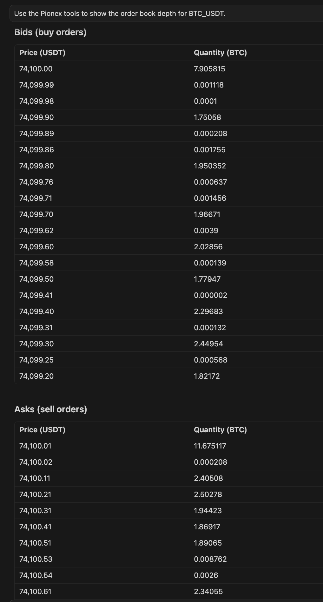
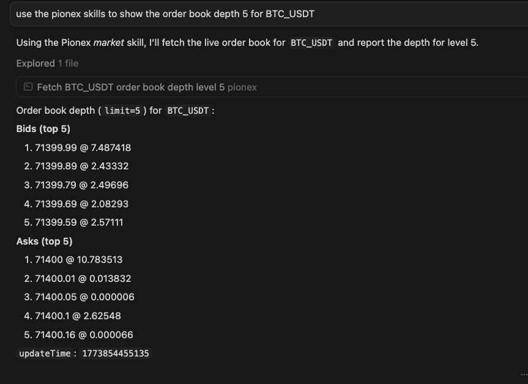

# Pionex AI Kit

[](#)
[](#)
[](https://www.npmjs.com/package/@pionex/pionex-trade-mcp)
[](https://www.npmjs.com/package/@pionex/pionex-trade-mcp)
[](https://www.npmjs.com/package/@pionex/pionex-ai-kit)
[](https://www.npmjs.com/package/@pionex/pionex-ai-kit)
[](LICENSE)

[English](README.md) | [中文](README.zh-CN.md)

Pionex AI Kit —— 一个将 AI 助手接入 Pionex 的交易工具集，目前包含两个独立 npm 包：

| 包 | 描述 |
|----|------|
| `@pionex/pionex-ai-kit` | CLI 工具，用于账号向导和 MCP 客户端配置；运行 `pionex-ai-kit onboard` 写入 `~/.pionex/config.toml`（API key、secret、base URL）。 |
| `@pionex/pionex-trade-mcp` | MCP Server，从 `~/.pionex/config.toml` 读取凭证，将 Pionex 交易能力暴露给 Cursor、Claude Desktop 等支持 MCP 的客户端。 |

---

## 这是什么？

Pionex AI Kit 通过 [Model Context Protocol](https://modelcontextprotocol.io) 将 Cursor、Claude Desktop 等 AI 客户端直接接入你的 Pionex 账号。

你只需要在对话里描述「想做什么」，例如「帮我在 BTC_USDT 下一个限价单」，AI 会调用本地 MCP Server 的工具，代你完成具体的下单和查询操作。

- **本地优先**：只以本地进程方式运行，API Key 存在环境变量或 `~/.pionex/config.toml` 中，不会进入聊天记录。
- **两个入口**：CLI 负责账号向导和客户端配置，MCP Server 负责真正的工具调用。
- **原生 MCP**：兼容所有支持 MCP 标准的客户端。

---

## 功能概览（Features）

### `@pionex/pionex-trade-mcp`

当前用于直接在 Pionex 上交易的 MCP Server。

| 模块 | 工具 | 是否需要鉴权 |
|------|------|--------------|
| **Market** | `pionex_market_get_depth`, `pionex_market_get_trades`, `pionex_market_get_symbol_info`, `pionex_market_get_tickers`, `pionex_market_get_klines` | 否 |
| **Account** | `pionex_account_get_balance` | 是 |
| **Orders** | `pionex_orders_new_order`, `pionex_orders_get_order`, `pionex_orders_get_order_by_client_order_id`, `pionex_orders_get_open_orders`, `pionex_orders_get_all_orders`, `pionex_orders_cancel_order`, `pionex_orders_get_fills`, `pionex_orders_cancel_all_orders` | 是 |


---

## 快速开始（Quick Start）

**前置要求：** Node.js ≥ 18

```bash
# 1. 安装 CLI
npm install -g @pionex/pionex-ai-kit

# 2. 配置 Pionex API 凭证（交互式向导）
pionex-ai-kit onboard

# 3. 将 MCP Server 注册到 AI 客户端（示例）
pionex-ai-kit setup --mcp=pionex-trade-mcp --client cursor
pionex-ai-kit setup --mcp=pionex-trade-mcp --client claude-desktop
pionex-ai-kit setup --mcp=pionex-trade-mcp --client claude-code
pionex-ai-kit setup --mcp=pionex-trade-mcp --client windsurf
pionex-ai-kit setup --mcp=pionex-trade-mcp --client vscode
pionex-ai-kit setup --mcp=pionex-trade-mcp --client openclaw
```

执行第 3 步时，`pionex-ai-kit setup` 会：

- 为各客户端写入 MCP 配置，使其可以通过 `npx @pionex/pionex-trade-mcp` 启动服务。

**4. 在 Agent 里试一下** — 在 AI 客户端里输入：*"Use the Pionex tools to show the order book depth for BTC_USDT."*，Agent 会调用 MCP 工具并展示买卖盘口。示例：



---
## 5. （可选）安装 Pionex Skills

如果你希望 Agent 按照**更安全、更可控的交易流程**（先检查、再预演 `--dry-run`、最后再执行），可以安装 `pionex-skills`。

1. 从 GitHub 安装 skills：
   ```bash
   npx skills add pionex-official/pionex-skills
   ```
2. 安装完成后，skills 会出现在 `~/.agents/skills/`（或你的 Agent 配置的 skills 目录）。
3. skills 会基于本地 `pionex` CLI 来执行工作流，例如：market-first checks、余额感知下单、以及写操作前的 dry-run。

效果截图：



---

## 1. 安装

```bash
npm install -g @pionex/pionex-ai-kit
```

这里只需要安装 **CLI**，用于账号向导和自动写入 MCP 客户端配置。

你可以根据自己的偏好选择：

- 直接依赖 `npx @pionex/pionex-trade-mcp`，在启动 MCP Server 时按需从 npm 拉取最新版本；或
- 手动执行 `npm install -g @pionex/pionex-trade-mcp`（可选），以便固定使用某个全局安装的版本。

---

## 2. 配置凭证（`~/.pionex/config.toml`）

运行 CLI 向导（来自 **pionex-ai-kit**）：

```bash
pionex-ai-kit onboard
```

向导会依次询问：

- **Pionex API Key**
- **Pionex API Secret**
- **Profile 名称**（默认：`default`）

配置会写入 `~/.pionex/config.toml`，支持多个 profile，并可通过 `default_profile` 指定默认使用哪个。

**`pionex-trade-mcp` 读取凭证的优先级：**

1. **环境变量**：`PIONEX_API_KEY`, `PIONEX_API_SECRET`, `PIONEX_BASE_URL`  
   - 可以来自 shell 的 `export`，也可以配置在 MCP 客户端的 `env` 字段。
2. **`~/.pionex/config.toml` 中的 profile**：仅在对应环境变量缺失时作为兜底。

MCP Server 自身不会把 API Key 写回客户端配置，只会从 env 和 `~/.pionex/config.toml` 读取。

---

## 3. 在 AI 客户端中注册 MCP Server

在凭证已经配置好的前提下，用 CLI 帮你把 `pionex-trade-mcp` 注册到常见 MCP 客户端：

```bash
pionex-ai-kit setup --mcp=pionex-trade-mcp --client cursor
```

然后 **重启 Cursor（或其他客户端）**。客户端配置中只会保存如何启动 Server（例如 `npx -y @pionex/pionex-trade-mcp`），**不会写入任何 API Key**，密钥只在本地文件或环境变量中。

当前支持的 `--client` 参数：

| `--client`       | 写入的配置文件 |
|------------------|----------------|
| `cursor`         | `~/.cursor/mcp.json` |
| `openclaw`       | `~/.openclaw/workspace/config/mcporter.json` |
| `claude-desktop` | macOS: `~/Library/Application Support/Claude/claude_desktop_config.json`；Linux/Windows 参见 Claude 文档 |
| `claude-code`    | 不写文件，执行 `claude mcp add --scope user --transport stdio pionex-trade-mcp -- @pionex/pionex-trade-mcp` |
| `claude` (别名)  | 同 `claude-code` |
| `windsurf`       | `~/.codeium/windsurf/mcp_config.json` |
| `vscode`         | 当前项目目录下 `.mcp.json` |

---

## 4. 手动配置 MCP（不用 `setup` 命令）

如果你更喜欢手动编辑配置文件，可以不执行 `pionex-ai-kit setup`，只需在对应客户端配置中添加一条 `pionex-trade-mcp` 的记录即可。凭证依然由 `~/.pionex/config.toml` 负责，**无需**在 `env` 中明文写 Key。

以 **Cursor**（`~/.cursor/mcp.json`）为例：

```json
{
  "mcpServers": {
    "pionex-trade-mcp": {
      "command": "npx",
      "args": ["-y", "@pionex/pionex-trade-mcp"]
    }
  }
}
```

其他客户端只需保持 `"command"` 和 `"args"` 形态一致即可。

---

## 5. 示例 Prompt（MCP 已连接后）

**行情（不需要 API Key）：**

- “Use the Pionex tools to show the order book depth for BTC_USDT.”
- “Use the Pionex tools to fetch the last 10 trades for ETH_USDT.”
- “Get symbol info for BTC_USDT and ADA_USDT.”

**账户 & 下单（需要 API Key）：**

- “Use the Pionex tools to list my spot balances.”
- “Use the Pionex tools to place a limit buy order for 0.01 BTC at 30000 USDT on BTC_USDT.”
- “Use the Pionex tools to get the status of order `<orderId>` for BTC_USDT.”
- “Use the Pionex tools to cancel order `<orderId>` for BTC_USDT.”

---

## 6. 安全提示

- **不要** 把 `~/.pionex/config.toml` 提交到任何代码仓库，也不要在聊天中直接贴出 API Key。
- 建议为 AI 单独创建权限最小化的 API Key。
- 实盘前先用小金额测试，视需要在 Pionex 后台开启 IP 白名单等安全措施。

---

## 7. 参与贡献（Contributing）

开发与发布相关说明请查看：

- [`CONTRIBUTING.md`](CONTRIBUTING.md)（英文）
- [`CONTRIBUTING.zh-CN.md`](CONTRIBUTING.zh-CN.md)（中文）

