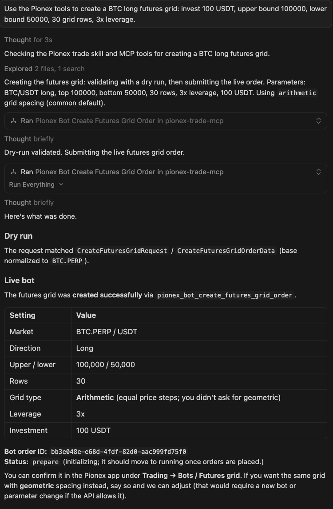
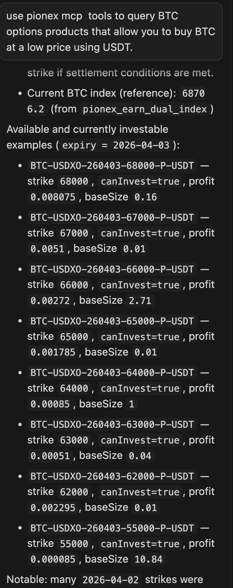
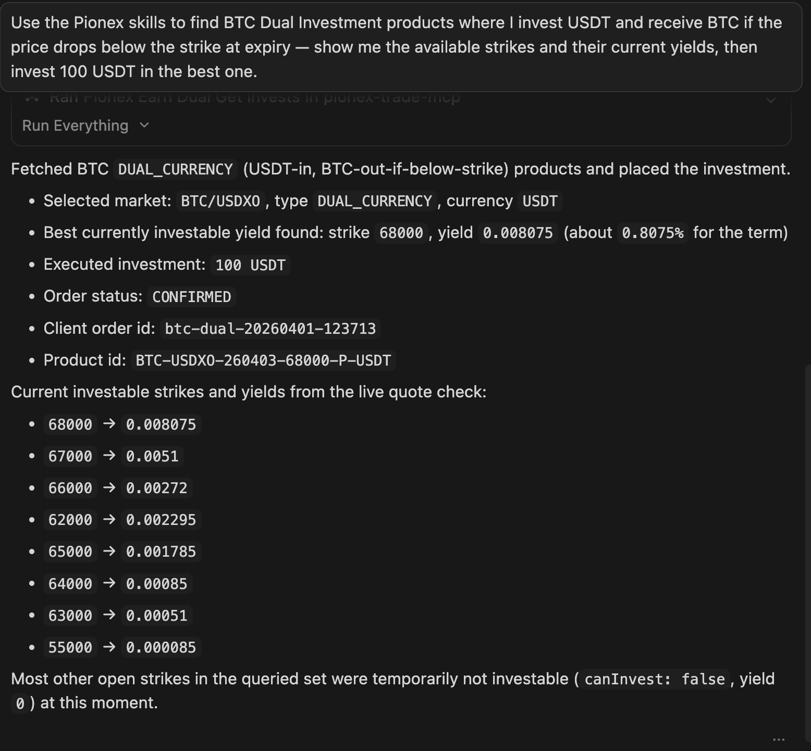

# Pionex AI Kit

[](#)
[](#)
[](https://www.npmjs.com/package/@pionex/pionex-ai-kit)
[](https://www.npmjs.com/package/@pionex/pionex-ai-kit)
[](https://www.npmjs.com/package/@pionex/pionex-trade-mcp)
[](https://www.npmjs.com/package/@pionex/pionex-trade-mcp)
[](LICENSE)

[English](README.md) | [简体中文](README.zh-hans.md) | 繁體中文

Pionex AI Kit —— AI 驅動的交易工具集，包含兩個獨立套件：

| 套件                         | 描述                                                                                                                                    |
| ---------------------------- | --------------------------------------------------------------------------------------------------------------------------------------- |
| `@pionex/pionex-ai-kit`    | CLI 工具，用於帳號引導和 MCP 用戶端配置；執行 `pionex-ai-kit onboard` 寫入 `~/.pionex/config.toml`（API key、secret、base URL）。 |
| `@pionex/pionex-trade-mcp` | MCP 伺服器，從 `~/.pionex/config.toml` 讀取憑證，將 Pionex 交易工具暴露給 Cursor、Claude Desktop 等 MCP 相容用戶端。                |

---

## 這是什麼？

Pionex AI Kit 為你提供一整套連接 Pionex 的 AI Agent 基礎設施，包括 MCP、Skills 和 CLI。支援 Cursor、Claude、OpenClaw、Windsurf、VSCode 等主流 AI Agent。

你只需在對話中描述想做什麼，AI 會呼叫本地 MCP 伺服器上的工具，在 Pionex 上執行相應的 API 呼叫，無需在 AI 和交易所介面之間來回切換。

- **本地優先**：以本地行程方式執行；API 金鑰儲存在環境變數或 `~/.pionex/config.toml` 中，不會出現在聊天記錄裡。
- **兩個入口**：CLI 負責帳號引導和配置，MCP 伺服器負責工具呼叫。
- **原生 MCP**：相容所有 MCP 標準用戶端。

---

## 功能

### MCP

用於在 Pionex 上交易的 MCP 伺服器。

| 套件                               | 模組                        | 工具                                                                                                                                                                                                                                                                                                                    | 驗證 |
| ---------------------------------- | --------------------------- | ----------------------------------------------------------------------------------------------------------------------------------------------------------------------------------------------------------------------------------------------------------------------------------------------------------------------- | ---- |
| **@pionex/pionex-trade-mcp** | **Market**            | `pionex_market_get_depth`、`pionex_market_get_trades`、`pionex_market_get_symbol_info`、`pionex_market_get_tickers`、`pionex_market_get_book_tickers`、`pionex_market_get_klines`                                                                                                                            | 否   |
|                                    | **Account**           | `pionex_account_get_balance`                                                                                                                                                                                                                                                                                          | 是   |
|                                    | **Wallet**            | `pionex_wallet_get_balance_full`                                                                                                                                                                                                                                                                                       | 是   |
|                                    | **Orders**            | `pionex_orders_new_order`、`pionex_orders_get_order`、`pionex_orders_get_order_by_client_order_id`、`pionex_orders_get_open_orders`、`pionex_orders_get_all_orders`、`pionex_orders_cancel_order`、`pionex_orders_get_fills`、`pionex_orders_get_fills_by_order_id`、`pionex_orders_cancel_all_orders` | 是   |
|                                    | **Bot / Futures Grid** | `pionex_bot_futures_grid_get_order`、`pionex_bot_futures_grid_create`、`pionex_bot_futures_grid_adjust_params`、`pionex_bot_futures_grid_reduce`、`pionex_bot_futures_grid_cancel`                                                                                                                            | 是   |
|                                    | **Bot / Spot Grid**    | `pionex_bot_spot_grid_get_order`、`pionex_bot_spot_grid_get_ai_strategy`、`pionex_bot_spot_grid_create`、`pionex_bot_spot_grid_adjust_params`、`pionex_bot_spot_grid_invest_in`、`pionex_bot_spot_grid_cancel`、`pionex_bot_spot_grid_profit`                                                                   | 是   |
|                                    | **Earn / Dual**        | `pionex_earn_dual_symbols`、`pionex_earn_dual_open_products`、`pionex_earn_dual_prices`、`pionex_earn_dual_index`、`pionex_earn_dual_delivery_prices`、`pionex_earn_dual_balances`、`pionex_earn_dual_get_invests`、`pionex_earn_dual_records`、`pionex_earn_dual_invest`、`pionex_earn_dual_revoke_invest`、`pionex_earn_dual_collect` | 部分（公開 + 驗證） |

---

### Skills

| Skill                                                                                                        | 描述                                         | 驗證 |
| ------------------------------------------------------------------------------------------------------------ | -------------------------------------------- | ---- |
| [pionex-market](https://github.com/pionex-official/pionex-skills/blob/main/skills/pionex-market/SKILL.md)       | 公開行情資料：盤口、行情、交易對、K 線、成交 | 否   |
| [pionex-portfolio](https://github.com/pionex-official/pionex-skills/blob/main/skills/pionex-portfolio/SKILL.md) | 帳戶餘額（現貨）                             | 是   |
| [pionex-wallet](https://github.com/pionex-official/pionex-skills/blob/main/skills/pionex-wallet/SKILL.md)       | 完整帳戶概覽：現貨＋合約餘額、幣種價格、USDT/BTC 估值 | 是   |
| [pionex-trade](https://github.com/pionex-official/pionex-skills/blob/main/skills/pionex-trade/SKILL.md)         | 現貨訂單：下單、撤單、查詢掛單、成交記錄     | 是   |
| [pionex-bot](https://github.com/pionex-official/pionex-skills/blob/main/skills/pionex-bot/SKILL.md)             | 合約網格：查詢、建立、調參、減倉、撤單       | 是   |
| [pionex-earn-dual](https://github.com/pionex-official/pionex-skills/blob/main/skills/pionex-earn-dual/SKILL.md)   | 雙幣理財：查產品、申購、撤單、收益提取       | 部分 |

### CLI

**`pionex-trade-cli`** —— 透過命令列直接存取 Pionex 行情、帳戶、訂單、合約網格機器人與雙幣理財

---

## 快速開始

### Claude Desktop — 一鍵安裝（.mcpb）

最簡單的方式是使用 `.mcpb` 安裝包，無需命令列：

1. 從 [GitHub Releases 頁面](https://github.com/pionex-official/pionex-ai-kit/releases/latest) 下載 `pionex-mcp.mcpb`
2. 雙擊檔案 — Claude Desktop 會彈出安裝對話框
3. 在提示框中填入你的 Pionex API Key 和 Secret（由 Claude Desktop 安全儲存）
4. 完成 — Pionex 工具已在 Claude Desktop 中可用

> **什麼是 `.mcpb`？** 這是 Claude Desktop 的原生 MCP 外掛格式，無需安裝 Node.js 或進行任何命令列設定。

---

### **透過 npm 安裝（Cursor、Windsurf、VS Code、Claude Code、OpenClaw）**

**前置要求：** Node.js ≥ 18

```bash
# 1. 安裝 Kit
npm install -g @pionex/pionex-ai-kit

# 2. 配置 Pionex API 憑證（互動式精靈）
pionex-ai-kit onboard

# 3. 將 MCP 伺服器註冊到你的 AI 用戶端（選擇你正在使用的）
# 此命令會為你的用戶端寫入相應的 MCP 配置，
# 使其可以透過 `npx @pionex/pionex-trade-mcp` 啟動服務。

pionex-ai-kit setup --mcp=pionex-trade-mcp --client cursor
pionex-ai-kit setup --mcp=pionex-trade-mcp --client claude-desktop
pionex-ai-kit setup --mcp=pionex-trade-mcp --client claude-code
pionex-ai-kit setup --mcp=pionex-trade-mcp --client windsurf
pionex-ai-kit setup --mcp=pionex-trade-mcp --client vscode
pionex-ai-kit setup --mcp=pionex-trade-mcp --client openclaw

# 4. 安裝 Skills
npx skills add pionex-official/pionex-skills
```

### 範例

<details>
<summary><strong>MCP 範例</strong></summary>

**盤口深度**

在 AI 用戶端中輸入：*"Use the Pionex tools to show the order book depth for BTC_USDT."*

Agent 會呼叫 MCP 工具並展示買賣盤口。


**合約網格（BTC 做多網格）**

在 AI 用戶端中輸入：*"Use the Pionex tools to create a BTC long futures grid: invest 100 USDT, upper bound 100000, lower bound 50000, 30 grid rows, 3x leverage."*

Agent 應呼叫 `pionex_bot_futures_grid_create`，並傳入對應的 `base`、`quote` 和 `buOrderData`。



**雙幣理財 — 查找低價買入 BTC 的產品**

在 AI 用戶端中輸入：*"用 Pionex MCP 工具，查詢投入 USDT、到期價格跌破履約價時獲得 BTC 的雙幣理財產品，列出可申購的履約價及當前收益率。"*

Agent 會呼叫 `pionex_earn_dual_open_products`（type=DUAL_CURRENCY）後再呼叫 `pionex_earn_dual_prices`，返回可申購產品及即時收益。



</details>

<details>
<summary><strong>Skills 範例</strong></summary>

**盤口深度**

在 AI 用戶端中輸入：*"Use the Pionex skills to show the order book depth 5 for BTC_USDT."*

Agent 會使用 Pionex market skill 並展示買賣盤口。


**合約網格（BTC 做多網格）**

在 AI 用戶端中輸入：*"Use the Pionex bot skill to create a BTC long futures grid: 100 USDT margin, price range 50000–100000, 30 rows, 3x leverage."*

Agent 會按照 `pionex-bot` skill 的指引，透過 CLI 或 MCP 工具完成建立。


**雙幣理財 — 查找低價買入 BTC 的產品**

在 AI 用戶端中輸入：*"用 Pionex Skills，查詢投入 USDT、到期價格跌破履約價時獲得 BTC 的雙幣理財產品，列出可申購的履約價及當前收益率。"*



</details>

<details>
<summary><strong>CLI 範例</strong></summary>

**行情與訂單**

```
# 盤口深度
pionex-trade-cli market depth BTC_USDT --limit 5

# 最近成交
pionex-trade-cli market trades BTC_USDT --limit 10

# 下一個市價買單（dry-run 模式）
pionex-trade-cli orders new --symbol BTC_USDT --side BUY --type MARKET --amount 100 --dry-run
```

**合約網格（BTC 做多網格）**

在 BTC/USDT 上建立做多合約網格：投入 100 USDT、上界 100000、下界 50000、30 格、3 倍槓桿（建議先 dry-run）：

```
pionex-trade-cli bot futures_grid create \
  --base BTC \
  --quote USDT \
  --bu-order-data-json '{"top":"100000","bottom":"50000","row":30,"grid_type":"arithmetic","trend":"long","leverage":3,"quoteInvestment":"100"}' \
  --dry-run
```

移除 `--dry-run` 即可真實下單。

**雙幣理財（earn dual）**

```
# 查看 BTC DUAL_BASE 開放產品（BTC/ETH 使用 quote=USDXO）
pionex-trade-cli earn dual open_products --base BTC --quote USDXO --type DUAL_BASE --currency USDT

# 申購 100 USDT（先 dry-run）
pionex-trade-cli earn dual invest \
  --base BTC \
  --product-id BTC-USDXO-260402-68000-P-USDT \
  --client-dual-id my-order-001 \
  --currency-amount 100 \
  --profit 0.0039 \
  --dry-run
```

</details>

---

## 使用手冊

- [`manual.zh-hant/`](manual.zh-hant/)

---

## 更新日誌

- [`CHANGELOG.zh-hant.md`](CHANGELOG.zh-hant.md)

---

## 安全

- **切勿**將 `~/.pionex/config.toml` 提交到程式碼倉庫，也不要在聊天中貼上 API 金鑰。
- 建議為 Agent 建立權限最小化的**專用 API 金鑰**。
- 交易前先用小金額測試；可在 Pionex API 設定中啟用 IP 白名單。

---

## 參與貢獻

開發、建構和發佈說明見 [`CONTRIBUTING.zh-hant.md`](CONTRIBUTING.zh-hant.md)。

---

## 💖 鳴謝

特別感謝：

* [@PavanKhatwani](https://github.com/PavanKhatwani) - 貢獻了 `.mcpb`（Claude Desktop 一鍵安裝器）。
